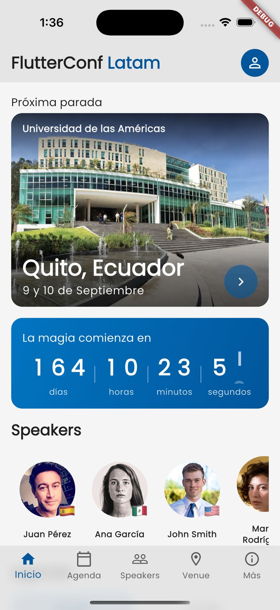
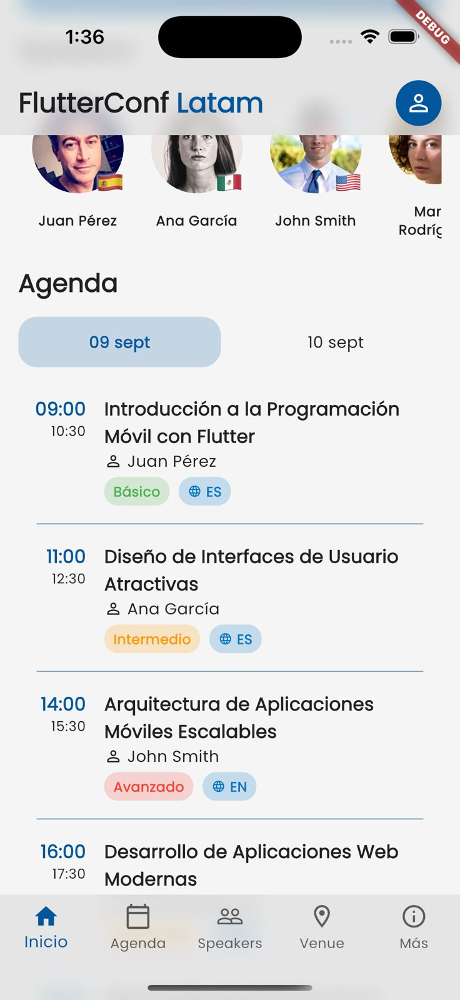
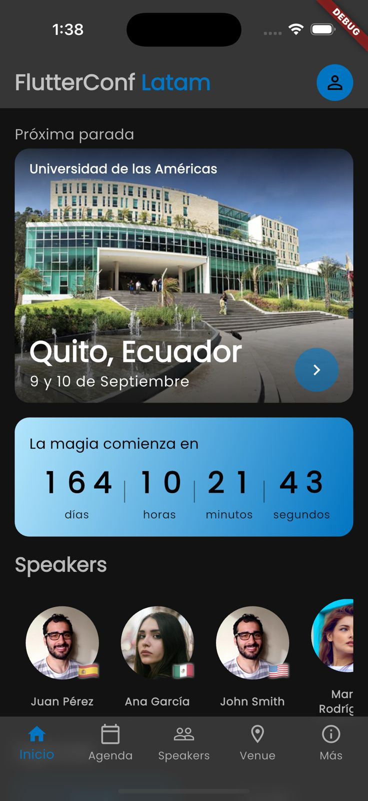
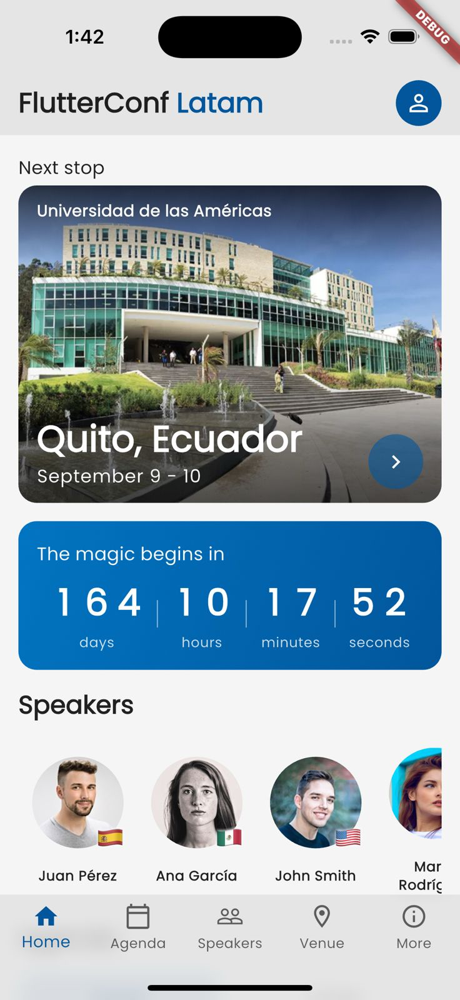
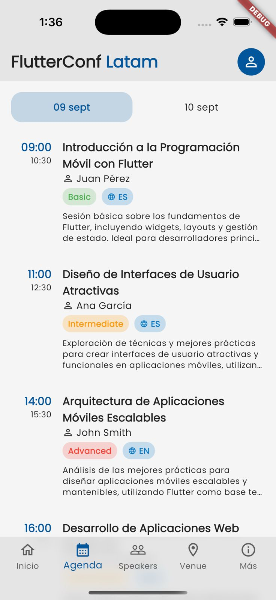
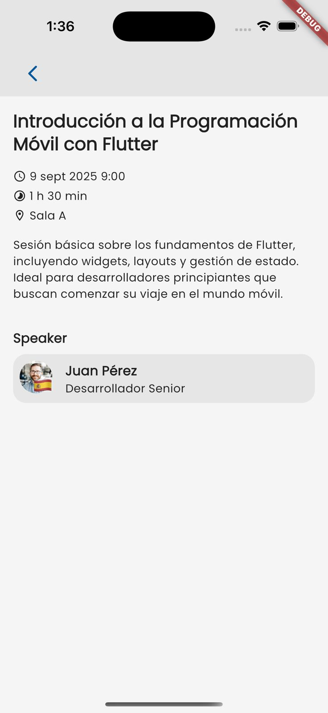
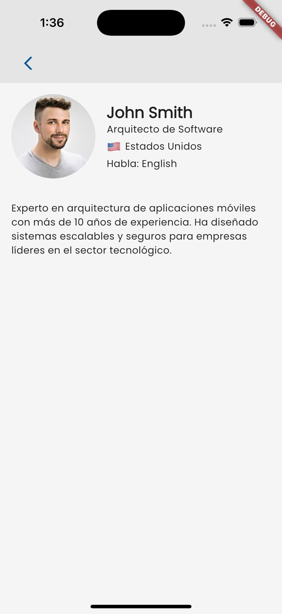
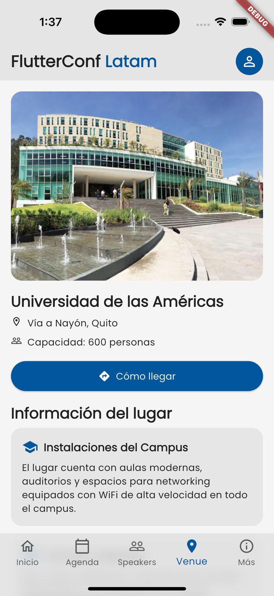
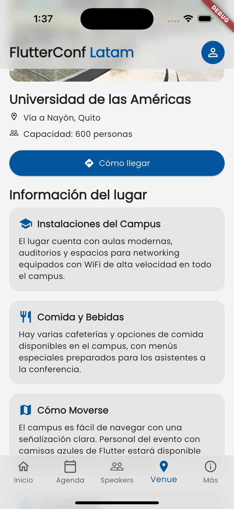
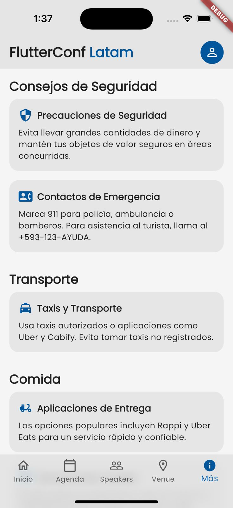

# FlutterConf Latam App

This is the official app for the FlutterConf Latam (Ecuador). The initial design is subject to changes as the UI/UX is being finalized.

## Current Design
Here are some previews of the app's design:

### Home
  
  
  

### Agenda
  

### Details
**Session Details**  
  

**Speaker Details**  
  

### Venue
  
  

### More
  

## Current Status
The initial design has been implemented but is subject to updates as the UI/